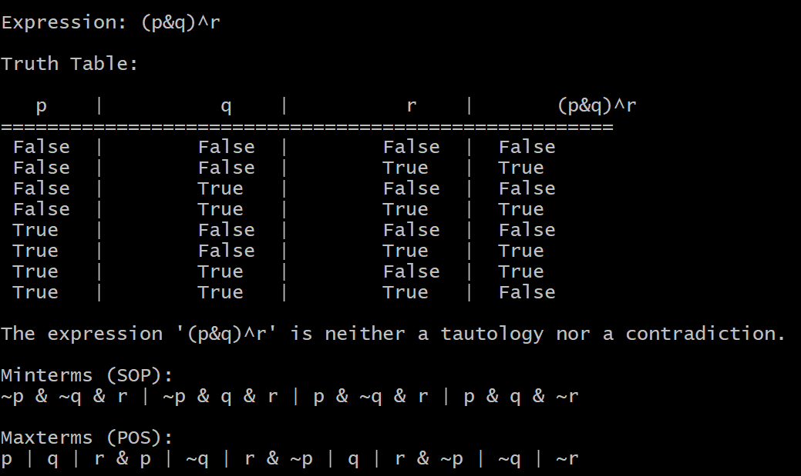
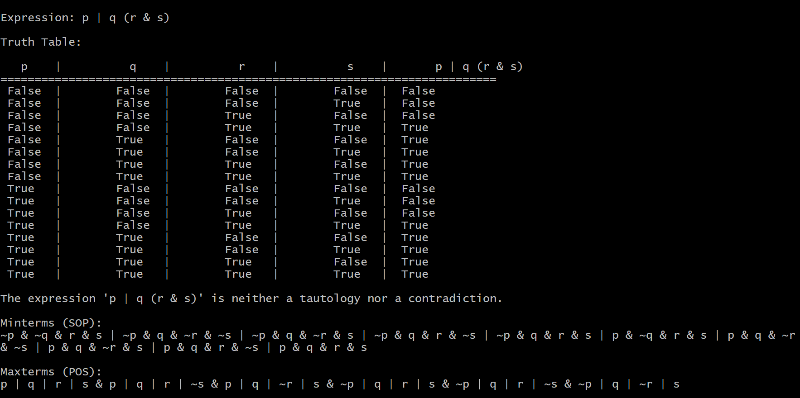
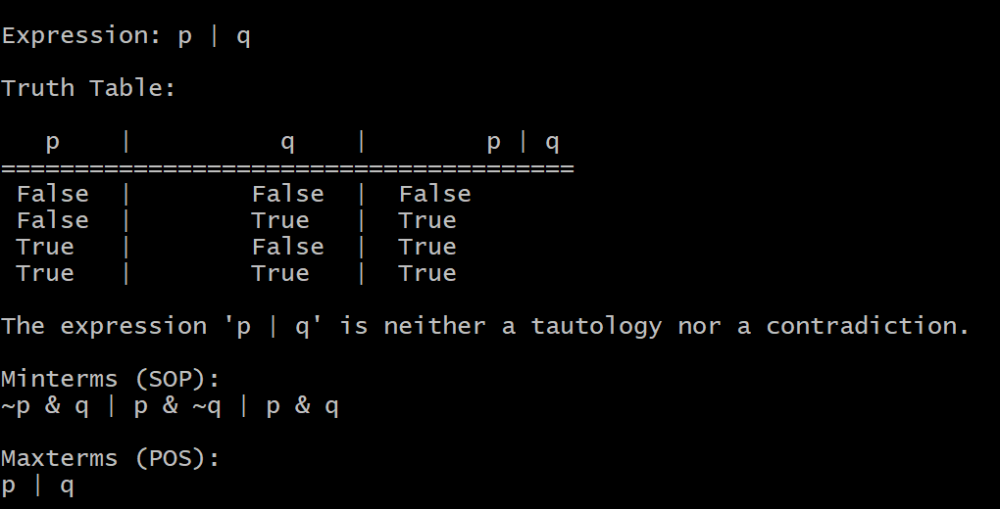

# Propositional Logic Toolkit

This toolkit provides functionality for working with propositional logic expressions, including generating truth tables, extracting minterms and maxterms, and checking properties such as tautology and contradiction.

Example 1

Example 2

Example 3

## Modules

### 1. main.py

This module serves as the entry point for the toolkit. It prompts users to input a logical expression and then generates its truth table, extracts minterms and maxterms, and checks whether the expression is a tautology or a contradiction.

### 2. expressions.py

This module contains functions for evaluating logical expressions and implementing logical operators. The functions include:

- `negation(p)`: Evaluates the negation of a proposition.
- `conjunction(p, q)`: Evaluates the conjunction (AND) of two propositions.
- `disjunction(p, q)`: Evaluates the disjunction (OR) of two propositions.
- `xor(p, q)`: Evaluates the exclusive OR (XOR) of two propositions.
- `implication(p, q)`: Evaluates the implication (→) from one proposition to another.
- `biconditional(p, q)`: Evaluates the biconditional (↔) between two propositions.
- `precedence(operator)`: Determines the precedence of logical operators.
- `shunting_yard(expression)`: Converts infix logical expressions to postfix notation using the shunting-yard algorithm.
- `evaluate_postfix(expression, assignment)`: Evaluates a postfix logical expression given variable assignments.
- `evaluate_expression(expression, assignment)`: Evaluates an infix logical expression given variable assignments.

### 3. generate_terms.py

This module contains functions for generating Sum of Products (SOP) and Product of Sums (POS) terms from a truth table. The functions include:

- `generate_sop(truth_table, variables)`: Generates SOP terms from a truth table.
- `generate_pos(truth_table, variables)`: Generates POS terms from a truth table.

### 4. check_property.py

This module contains a function for checking whether a given logical expression is a tautology, a contradiction, or neither. The function includes:

- `check_property(expression, variables)`: Checks if the expression is a tautology, a contradiction, or neither, by evaluating it for all possible truth value assignments to its variables.

## Usage

To use the program follow these steps:

1. Run `main.py`.
2. Enter a logical expression when prompted.
3. The toolkit will generate the truth table, extract minterms and maxterms, and check if the expression is a tautology or a contradiction.

## Supported Operators

The program supports the following logical operators:

- Negation: `~`
- Conjunction: `&`
- Disjunction: `|`
- Exclusive OR: `^`
- Implication: `->`
- Biconditional: `<->`
